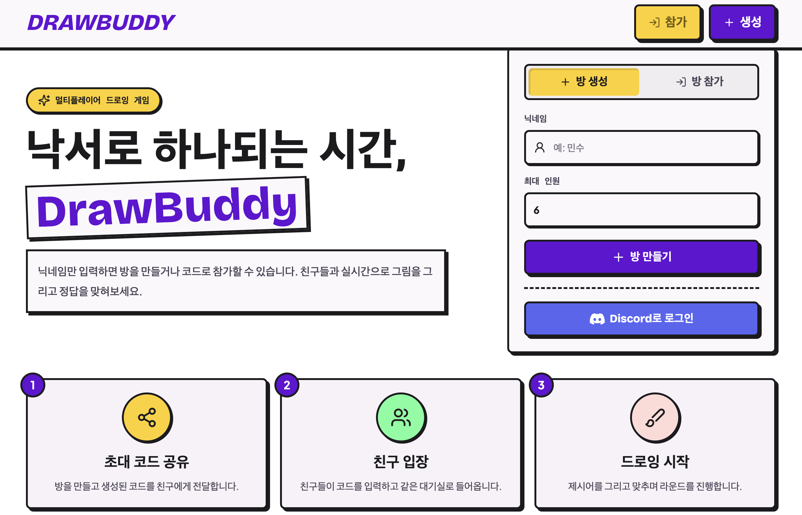

# DrawBuddy 🎨✍️

<p align="center">
  
</p>

**DrawBuddy**는 친구들과 함께 즐길 수 있는 **갈틱폰(Gartic Phone) 스타일의 실시간 글/그림 릴레이 웹 게임**입니다. 
첫 문장을 제시하고, 다음 사람이 그 문장을 보고 그림을 그리며, 또 다음 사람이 그림을 보고 문장으로 추측하는 릴레이 과정을 통해 기상천외하고 재미있는 결과물을 만들어냅니다.

> 🚀 **지금 바로 플레이 해보기 (배포 링크):** [https://draw-buddy.vercel.app/](https://draw-buddy.vercel.app/)

---

<p align="center">
  
</p>

---

## ✨ 주요 기능 (Features)

- 🔐 **디스코드 소셜 로그인 연동**: 번거로운 회원가입 없이 디스코드 계정으로 간편하게 로그인 및 아바타/닉네임 연동 (게스트 로그인 지원)
- 🏠 **실시간 대기실 (Lobby)**: WebSocket을 활용한 실시간 접속자 확인, 준비(Ready) 상태 동기화 및 방 설정(제한 시간 등) 변경
- 🔄 **글/그림 릴레이 시스템**: `첫 문장 작성` ➡️ `그림 그리기` ➡️ `그림 설명하기` ➡️ `그림 그리기` 형태로 이어지는 릴레이 턴 시스템
- ⏱️ **실시간 캔버스 & 타이머**: 브러시 색상 및 굵기 조절을 지원하는 드로잉 캔버스와 턴 진행 상태(제출자 수) 실시간 표시
- 🎬 **결과 앨범 및 리플레이**: 모든 턴이 종료된 후, 각 릴레이 체인의 결과물을 방장의 슬라이드 조작에 맞춰 **모든 유저가 동시에 시청**하는 기능 지원 (그림 그리는 과정 리플레이 포함)
- 🔄 **게임 후 대기실 복귀**: 결과 확인 후 방장의 조작 한 번으로 모든 플레이어가 준비 상태를 해제하고 함께 대기실로 자동 복귀

---

## 🛠 기술 스택 (Tech Stack)

### Frontend
- **Framework:** React + Vite, TypeScript
- **Styling:** Tailwind CSS
- **State Management & API:** Fetch API, WebSocket (Native)

### Backend
- **Framework:** Django 5.2, Django REST Framework (DRF)
- **WebSocket:** Django Channels (ASGI)
- **Database:** SQLite (Local) / PostgreSQL (Production)
- **Documentation:** drf-spectacular (Swagger/Redoc)

---

## 🚀 로컬 환경 실행 방법 (Getting Started)

프론트엔드와 백엔드를 연동하기 위해 **반드시 IP 호스트(`127.0.0.1`)**를 명시하여 실행해야 합니다.

### 1. 백엔드 (Backend)
```bash
# 가상환경 활성화 (예: conda)
conda activate ex

# 디렉토리 이동
cd backend

# 패키지 설치
pip install -r requirements.txt

# 데이터베이스 마이그레이션 적용
python manage.py migrate

# 서버 실행 (반드시 127.0.0.1 지정)
python manage.py runserver 127.0.0.1:8000
```

### 2. 프론트엔드 (Frontend)
```bash
# 디렉토리 이동
cd frontend

# 패키지 설치
npm install

# 개발 서버 실행 (반드시 127.0.0.1 호스트 지정)
npm run dev -- --host 127.0.0.1
```

### 3. 환경 변수 (`.env`) 설정
`backend/.env` 파일에 아래 내용을 구성해야 정상적으로 동작합니다.
```env
SECRET_KEY=your_secret_key_here
DEBUG=True
ALLOWED_HOSTS=127.0.0.1,localhost,*
FRONTEND_BASE_URL=http://127.0.0.1:5173

# 디스코드 로그인 설정 (디스코드 개발자 포털 발급)
DISCORD_CLIENT_ID=your_client_id
DISCORD_CLIENT_SECRET=your_client_secret
DISCORD_REDIRECT_URI=http://127.0.0.1:8000/api/auth/discord/callback/
```

---

## 📝 추가 개발 예정 사항 (TODO)
- [ ] 유저가 방을 나갈 때 남은 유저들의 화면이 즉시 갱신되도록 **방 나가기(Leave) 로직에 웹소켓 브로드캐스트** 추가
- [ ] 배포 환경(Render / Vercel)을 고려한 Redis 기반 채널 레이어(Channel Layer) 및 DB(PostgreSQL) 전환 최적화
