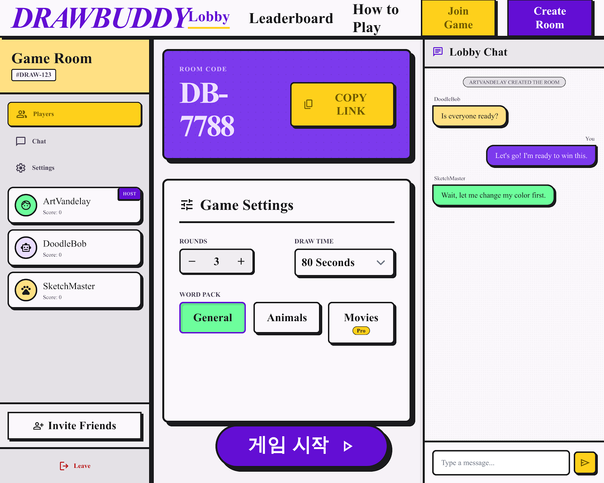

# DrawBuddy

DrawBuddy는 갈틱폰 스타일의 웹 기반 글/그림 릴레이 게임입니다. 사용자는 닉네임으로 방을 만들거나 방 코드로 참가하고, 게임이 시작되면 문장과 그림을 번갈아 이어 갑니다. 모든 릴레이가 끝난 뒤에는 작성자와 그림 과정을 결과 화면에서 공개할 예정입니다.

현재는 **게임 진행 전체 REST API**, **React 화면 UI 마이그레이션**, **대기실 실시간 WebSocket(채팅 및 상태 동기화)** 까지 모두 구현되어 있습니다. 현재 프론트엔드 인게임 화면의 API Fetch 연동 작업 중입니다.
현재는 **게임 진행 전체 REST API**, **React 화면 UI 마이그레이션**, **대기실 실시간 WebSocket(채팅 및 상태 동기화)** 및 **프론트엔드 인게임 화면의 API Fetch 연동**까지 모두 구현되어 있습니다.

### 게임 대기실



## 게임 흐름

```text
방 생성 또는 참가
→ 로비에서 참가자 확인 및 준비
→ 방장이 게임 시작
→ 참가자별 첫 문장 작성
→ 다음 사람이 문장을 보고 그림
→ 다음 사람이 그림을 보고 문장 작성
→ 참가자 수만큼 반복
→ 결과 앨범 공개
→ 그림 리플레이 재생
```

핵심 정책:

- 게임 진행 중에는 작성자를 공개하지 않습니다.
- 작성자는 결과 화면에서만 공개합니다.
- 채팅은 로비와 결과 화면에서만 제공할 예정입니다.
- 그림 리플레이는 PNG나 영상이 아니라 선 좌표 이벤트를 저장해서 재생합니다.
- Discord Activity는 범위에서 제외하고, 일반 웹 Discord OAuth 로그인만 추후 추가합니다.

## 기술 스택

### Backend

- Python
- Django 5.2
- Django REST Framework
- drf-spectacular
- SQLite 개발 DB
- Django session 기반 참가자 식별

### Frontend

- React 18
- Vite
- TypeScript
- Tailwind CSS
- lucide-react
- Canvas API 예정
- WebSocket client 예정

## 프로젝트 구조

```text
draw_buddy/
├── backend/
│   ├── config/                  # Django 설정, URL
│   ├── game/
│   │   ├── migrations/
│   │   ├── services/
│   │   │   ├── default_prompts.py
│   │   │   ├── game_start.py
│   │   │   └── session_player.py
│   │   ├── models.py
│   │   ├── serializers.py
│   │   ├── urls.py
│   │   ├── views.py
│   │   └── tests.py
│   ├── manage.py
│   └── requirements.txt
├── frontend/
│   ├── src/
│   │   ├── screens/
│   │   │   ├── LobbyScreen.tsx
│   │   │   └── RoomScreen.tsx
│   │   ├── api.ts
│   │   └── App.tsx
│   └── package.json
└── docs/
    ├── API_SPEC.md
    └── BACKEND_TODO.md
```

## 실행 방법

### 1. 백엔드 설치

현재 개발 환경에서는 `conda`의 `ex` 환경을 사용합니다.

```bash
conda activate ex
pip install -r backend/requirements.txt
```

DB migration을 적용하고 서버를 실행합니다.

```bash
cd backend
python manage.py migrate
python manage.py runserver 127.0.0.1:8000
```

### 2. 프론트엔드 설치

새 터미널에서 실행합니다.

```bash
cd frontend
npm install
npm run dev -- --host 127.0.0.1
```

기본 접속 URL:

```text
http://127.0.0.1:5173/
```

Vite가 `/api` 요청을 `http://localhost:8000`으로 proxy 처리합니다. `5173` 포트가 이미 사용 중이면 Vite가 `5174`, `5175` 같은 다음 포트를 사용할 수 있습니다.

### 3. 서버 종료

서버가 실행 중인 터미널에서 `Ctrl + C`를 누릅니다.

포트가 계속 점유되어 있으면 PID를 확인한 뒤 종료합니다.

```bash
lsof -nP -iTCP:8000 -sTCP:LISTEN
lsof -nP -iTCP:5173 -sTCP:LISTEN
kill <PID>
```

## API 문서

백엔드 실행 후 아래 URL에서 확인할 수 있습니다.


| 문서             | URL                                 |
| -------------- | ----------------------------------- |
| Swagger UI     | `http://127.0.0.1:8000/api/docs/`   |
| OpenAPI schema | `http://127.0.0.1:8000/api/schema/` |
| ReDoc          | `http://127.0.0.1:8000/api/redoc/`  |


상세 명세:

- [MVP API 명세](docs/API_SPEC.md)
- [백엔드 TODO](docs/BACKEND_TODO.md)

## 현재 구현 상태

### Backend


| Method  | Endpoint                                           | 설명                |
| ------- | -------------------------------------------------- | ----------------- |
| `GET`   | `/api/`                                            | smoke 응답          |
| `POST`  | `/api/rooms/`                                      | 방 생성 및 방장 참가      |
| `GET`   | `/api/rooms/{room_code}/`                          | 방 정보 조회           |
| `POST`  | `/api/rooms/{room_code}/join/`                     | 닉네임으로 방 참가        |
| `PATCH` | `/api/rooms/{room_code}/ready/`                    | 본인 준비 상태 변경       |
| `PATCH` | `/api/rooms/{room_code}/settings/`                 | 방장이 제한 시간 설정 변경   |
| `POST`  | `/api/rooms/{room_code}/leave/`                    | 현재 session 참가자 퇴장 |
| `POST`  | `/api/rooms/{room_code}/players/{player_id}/kick/` | 방장이 선택한 참가자 내보내기  |
| `POST`  | `/api/rooms/{room_code}/start/`                    | 게임 시작             |
| `GET`   | `/api/games/{game_id}/state/`                      | 현재 참가자의 게임 턴 조회   |
| `POST`  | `/api/games/{game_id}/turns/{turn_id}/prompt/`     | 첫 문장 제출 완료 처리       |
| `POST`  | `/api/games/{game_id}/turns/{turn_id}/drawing/complete/` | 그림 제출 완료 처리       |
| `POST`  | `/api/games/{game_id}/turns/{turn_id}/guess/`      | 그림 설명(Guess) 제출 완료 처리|
| `GET`   | `/api/games/{game_id}/results/`                    | 게임 종료 후 전체 결과 조회 |
| `GET`   | `/api/replays/{replay_id}/`                        | 그림 리플레이 좌표 데이터 조회 |
| `GET`   | `/api/auth/me/`                                    | 현재 접속 중인 세션 유저 정보 조회 |
| `POST`  | `/api/auth/logout/`                                | 세션 만료 및 로그아웃 |
| `GET`   | `/api/health/`                                     | 백엔드 서버 헬스체크        |


게임 시작 시 서버는 다음 작업을 수행합니다.

- `Room.status`를 `playing`으로 변경
- `GameSession` 생성
- 참가자별 `GameChain` 생성
- 참가자별 첫 문장용 `GameTurn` 생성
- 기본 문장 목록에서 참가자 수만큼 문장을 중복 없이 랜덤 배정
- 모든 참가자가 턴을 제출하면 백트래킹 알고리즘을 통해 겹치지 않는 체인으로 다음 턴(그림) 무작위 배정

### Frontend

현재 프론트에서 실제 API와 연결된 기능:

- 방 생성
- 방 코드 참가
- 방 정보 조회
- 초대 링크 복사
- 로비 화면 렌더링
- 준비 상태 변경
- 방 설정 변경
- 방 나가기
- 참가자 내보내기
- 게임 시작
- 게임 진행 화면(대기실, 프롬프트, 드로잉, 예측, 결과, 리플레이) 실제 API Fetch 연동 완료

아직 프론트 연결/백엔드 보완이 필요한 기능:

- 제한 시간 초과 시 턴 자동 제출 (Auto Submit)
- 방 나가기 시 웹소켓 동기화 잔상 해결
- 디스코드 연동 프로필 이미지 표시 디버깅
- 실시간 그림 선 긋기 데이터 웹소켓 연동 (현재는 턴 종료 시 REST API로 한 번에 전송 중)

## 주요 데이터 모델


| 모델              | 역할                        |
| --------------- | ------------------------- |
| `Room`          | 방 코드, 상태, 인원 제한, 제한 시간    |
| `RoomPlayer`    | 방 참가자, 닉네임, 방장 및 준비 상태    |
| `GameSession`   | 한 번의 게임 진행 상태             |
| `GameChain`     | 한 명의 첫 문장에서 시작하는 결과 앨범    |
| `GameTurn`      | 문장, 그림, 그림 설명 중 하나의 제출 단계 |
| `DrawingReplay` | 그림 선 좌표 이벤트 저장            |


## 테스트

백엔드:

```bash
cd backend
conda activate ex
python manage.py check
python manage.py test game
python manage.py makemigrations --check --dry-run
```

프론트엔드:

```bash
cd frontend
npm run build
```

## 다음 작업

가장 가까운 다음 구현 대상: 잔존 버그 수정 및 안정화

진행 순서:

1. 특정 턴 제한 시간 초과 시 서버에서 자동 제출 처리 (무한 대기 방지)
2. 참가자 방 퇴장 시 남아있는 유저들에게 즉각적인 웹소켓 동기화 반영
3. 디스코드 로그인 프로필 이미지 렌더링 디버깅
4. (선택) 인게임 선 긋기 데이터 실시간 웹소켓 연동 추가

## 운영 전 확인 사항

현재 설정은 로컬 개발용입니다. 배포 전 반드시 아래 항목을 처리해야 합니다.

- `DEBUG = False`
- `SECRET_KEY`를 환경 변수로 이동
- 실제 도메인을 `ALLOWED_HOSTS`와 `CSRF_TRUSTED_ORIGINS`에 등록
- SQLite를 PostgreSQL로 교체 검토
- `/admin/`, `/api/docs/`, `/api/redoc/` 공개 여부 결정
- 오래된 방 정리를 위한 `cleanup_stale_rooms` command 추가
- 방 코드 충돌 시 `IntegrityError` 재시도 처리
- WebSocket 도입 후 재접속 유예 시간과 heartbeat 정책 적용

운영 안정성 정책은 [백엔드 TODO](docs/BACKEND_TODO.md#10-운영-안정성-todo)에 정리되어 있습니다.
